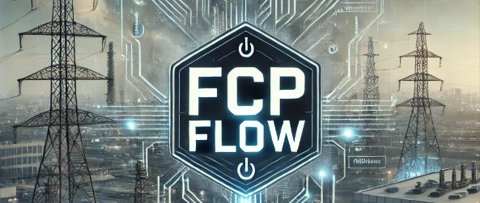
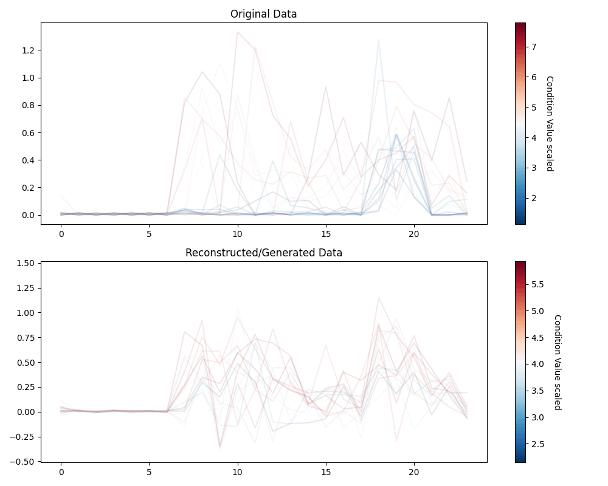

# Full-Convolutional-Profile-Flow

<p align="center">
  
</p>

Welcome to the repository containing the implementation of algorithms from the paper titled **'A Flow-Based Model for Conditional and Probabilistic Electricity Consumption Profile Generation and Prediction'**. Our Paper is available at [Link](https://arxiv.org/abs/2405.02180).

- We have provided detailed tutorials for you to undershtand our model, check at [Tutorials](tutorials).
- All process data for this project are available at [Data](data).
- To reproduce experiments in our paper, check [Exp](exp).
- **HOW TO TRAIN YOUR OWN FCPflow?** Check below.

## Tutorials

To get started with our models and understand how they work, we have prepared several tutorials. Please click on the links below to explore them:

[Conditional Generation Tutorial](tutorials/tutorial_conditioanl_gen.ipynb): (**Beginner friendly**) This tutorial guides you through generating electricity consumption profiles conditionally.

[Unconditional Generation Tutorial](tutorials/tutorial_uncond_gen.ipynb): Learn how to generate electricity consumption profiles without specific conditions.

[Prediction Tutorial](tutorials/tutorial_prediction.ipynb): Dive into predicting future electricity consumption profiles based on past data.

We highly recommend going through these tutorials in the order listed above to gain a comprehensive understanding of the models and their applications. Especially **Conditional Generation** tutorial.

## Code of Other Models

For the code of t-Copula used in the paper, please check: [t-Copula](https://github.com/MauricioSalazare/multi-copula)

For the of GAN, VAE, etc, please check: [Generative models](https://github.com/xiaweijie1996/Generative-Models-for-Customer-Profile-Generation).

## How to Train Your Own FCPflow

#### Creating Environment

First, creating a virtual environment and activate:
```bash
conda create --name fcpflow_env
conda activate fcpflow_env
```

#### Install the Package

```
pip install git+https://github.com/xiaweijie1996/Full-Convolutional-Profile-Flow.git
```
#### Usage
```
import pandas as pd
import numpy as np
import matplotlib.pyplot as plt
from fcpflow_package import FCPflowPipeline

# Initialize the pipeline
pipeline = FCPflowPipeline(
    num_blocks = 2,  # Number of blocks in the model
    num_channels = 24,  # Resolution of the time series 
    hidden_dim = 12,  # Dimension of the hidden layers
    condition_dim = 1,  # Dimension of the condition vector, must be larger than 1
    sfactor = 0.3,  # Scaling factor
)

# Define the save path
save_path = ''  # Directory where model and outputs will be saved

# Prepare the data
data_path = 'nl_data_1household.csv'
np_array = pd.read_csv(data_path).iloc[:, 3:-2].values
np_array = np_array[~pd.isna(np_array).any(axis=1)]
np_array = np.hstack((np_array, np.ones((np_array.shape[0], 1))))

# Define the learning set and the model 
pipeline._define_learning_set()
pipeline._define_model()

# Train the model
pipeline.train_model(1, np_array[:20,:], None, save_path, device='cpu', train_scheduler=False)

# Load the trained model (If you have trained model, you can directly load)
model_path = save_path + 'FCPflow_model.pth'
model = pipeline.load_model(model_path)

# This step is neccessary as we scale the data in trianing
# In thes step we fit a scaler
pipeline.data_processing(np_array, None)

# Sample from the trained model
condition_array = np_array[:10, -1:]
samples = pipeline.sample_from_trained_model(condition_array, device='cpu')

# Plot the samples
plt.plot(samples[:, :-1].T)
plt.savefig(save_path + 'sample.png')
```

We train few step and save the generation results of these steps which are shown below 

<p align="center">
  
</p>

## FCPFlow Model Structure


## Data Sources

The research uses raw data from the following open-source databases:

- **Netherlands Smart Meter Data**: [Liander Open Data](https://www.liander.nl/partners/datadiensten/open-data/data)
- **UK Smart Meter Data**: [London Datastore](https://data.london.gov.uk/dataset/smartmeter-energy-use-data-in-london-households)
- **Germany Smart Meter Data**: [Open Power System Data](https://data.open-power-system-data.org/household_data/2020-04-15)
- **AUS Smart Meter Data**: [Smart-Grid Smart-City Customer Trial Data](https://data.gov.au/dataset/ds-dga-4e21dea3-9b87-4610-94c7-15a8a77907ef/details)
- **USA Smart Meter Data**:  [DATAPORT](https://dataport.pecanstreet.org/)


## Contact and Citations
For inquiries, suggestions, or potential collaborations, please reach out to Weijie Xia at [w.xia@tudelft.nl](mailto:w.xia@tudelft.nl).

To cite the research paper related to this project, please use the following Bibtex entry:

Xia, W., Wang, C., Palensky, P., & Vergara, P. P. (2024). _A Flow-Based Model for Conditional and Probabilistic Electricity Consumption Profile Generation and Prediction_. arXiv preprint arXiv:2405.02180.

```bibtex
@article{xia2024flow,
  title={A Flow-Based Model for Conditional and Probabilistic Electricity Consumption Profile Generation and Prediction},
  author={Xia, Weijie and Wang, Chenguang and Palensky, Peter and Vergara, Pedro P},
  journal={arXiv preprint arXiv:2405.02180},
  year={2024}
}
